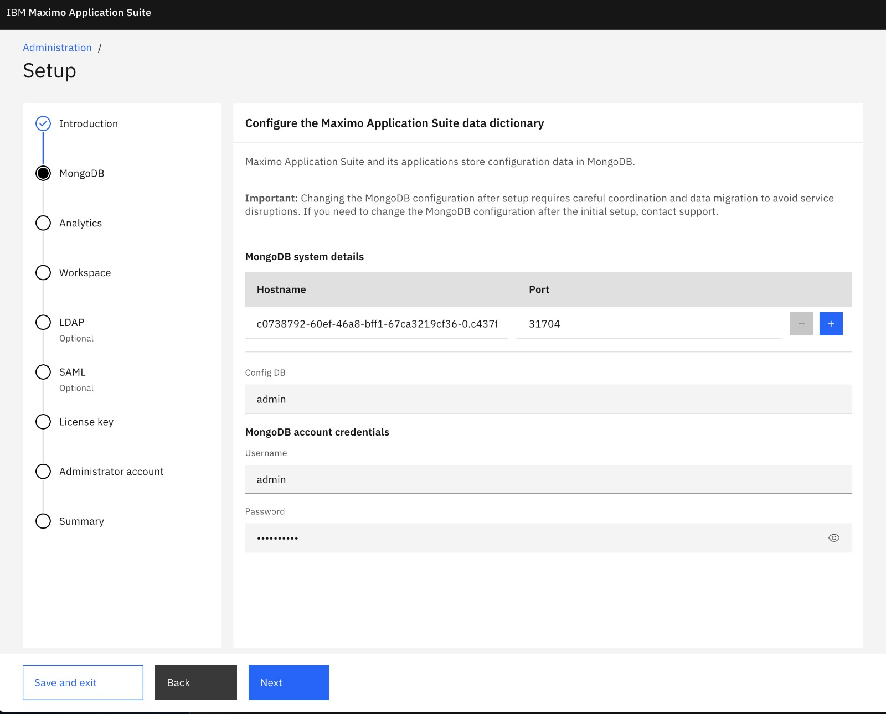
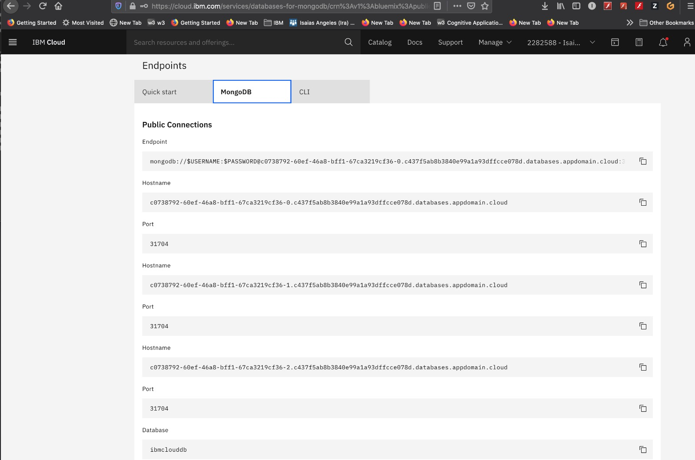
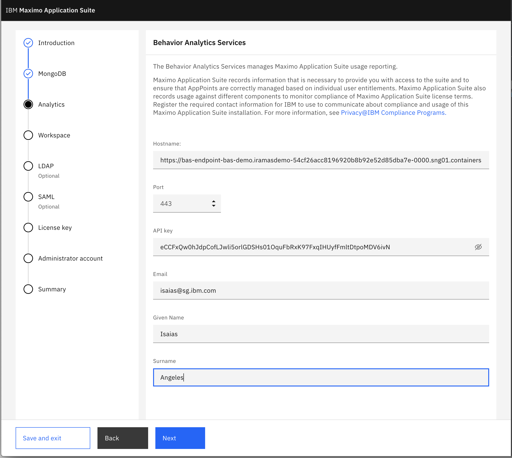
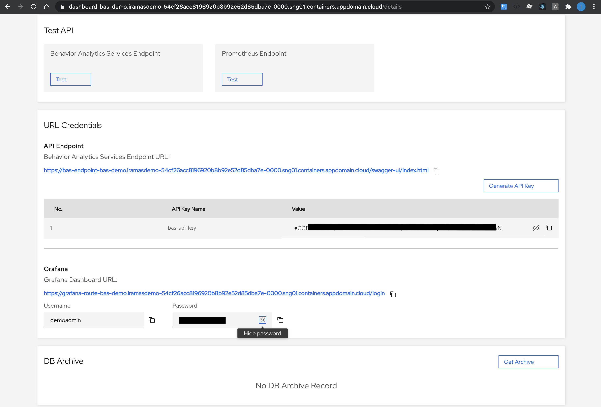

# IBM Maximo Application Suite

Navigate to [IBM Maximo Application Suite Documentation](https://www.ibm.com/docs/en/mas) for the installation and setup information

# MongoDB installation in IBM Cloud service

Enter the Hostnames and corresponding port.  

For MongoDB instance in IBM Cloud, enter all the hostnames and corresponding ports.

# Behavior Analytics Services

Proceed to this link for the instuctions

https://developer.ibm.com/openlabsdev/guide/behavior-analytics-services/course/bas-install/01.01

Enter the following information in the MAS BAS config

Information from `Behavior Analytics Services`

